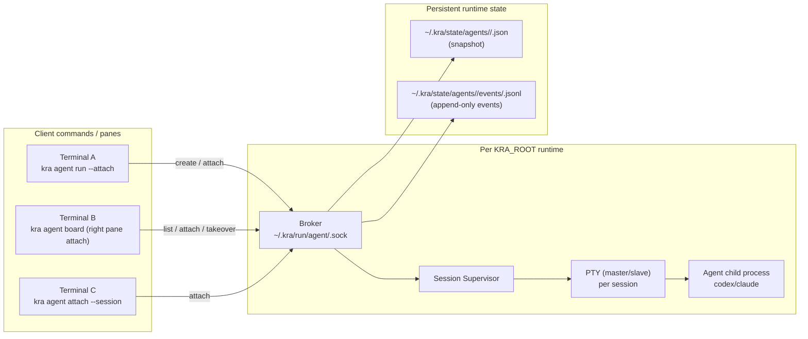
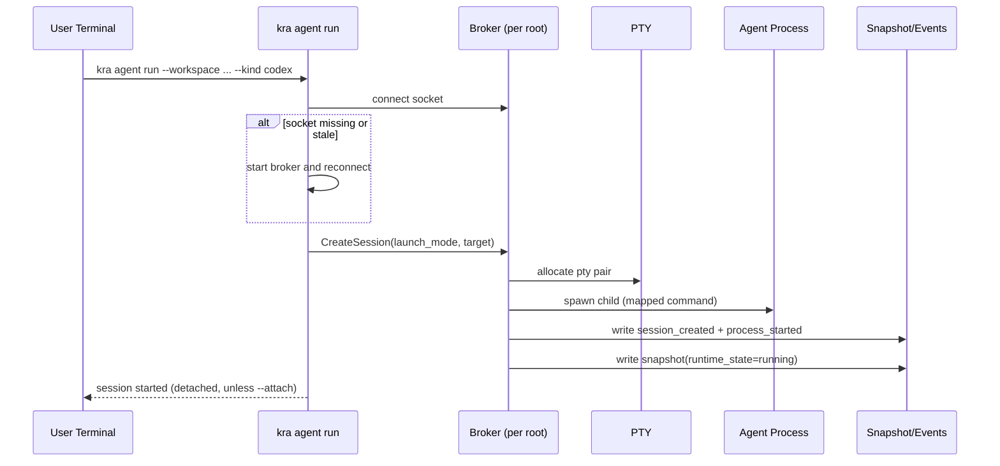
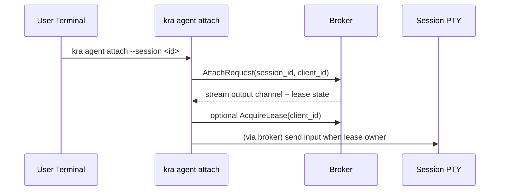

# Agent Runtime Architecture (v3 draft)

## Goal

Define a runtime architecture for `kra agent` that:

- keeps agent sessions alive independently of terminal tabs
- supports operator control from manager UI (observe + send input)
- keeps runtime noise out of `KRA_ROOT` Git working tree
- stays simple enough for MVP while preserving future extensibility

## Decision Snapshot

This document reflects current agreed decisions:

- broker model: per-`KRA_ROOT` local broker over Unix socket
- launch model: detached by default (`--attach` is opt-in)
- connection model: multi-attach allowed
- input model: writer lease required, immediate takeover allowed
- safety model: confirm dangerous control keys (`Ctrl-C`, `Ctrl-D`, `Ctrl-Z`)
- state model: snapshot (`current state`) + append-only events (`history/audit`)
- run launch abstraction: `--launch default|resume|continue`
- attach scope: allowed only in workspace/repo context; root/outside is strict error

## Beginner-Friendly Terms

- session: one running agent process instance (for one workspace or repo target)
- attach: connect a terminal/pane to an existing running session
- detach: disconnect only the viewer/input client; session keeps running
- broker: local manager process that owns PTYs and child agent processes
- PTY: pseudo terminal pair (master/slave) that makes CLI agents behave like real terminal apps
- lease: temporary ownership token that allows one client to send input

## Scope

In scope:

- runtime process model for `run/list/board/attach/stop`
- local broker lifecycle under one `KRA_ROOT`
- PTY execution and attach/detach behavior
- current-state snapshot and event log contract
- writer lease and takeover rules

Out of scope:

- multi-host/distributed orchestration
- remote network control plane
- provider-internal conversation semantics beyond launch mapping

## Component Topology



## Concept Map (ASCII)

```text
KRA_ROOT (project context)
└─ root-hash (identity for this root)
   ├─ broker socket
   │  └─ ~/.kra/run/agent/<root-hash>.sock
   └─ runtime state
      └─ ~/.kra/state/agents/<root-hash>/
         ├─ <session-id>.json              # snapshot (current)
         └─ events/<session-id>.jsonl      # timeline (append-only)

Broker (per root)
├─ session s-...-1001
│  ├─ PTY
│  ├─ child process: codex|claude
│  ├─ attached clients: [board-right-pane, terminal-tab]
│  └─ writer lease owner: board-right-pane
└─ session s-...-1002
   └─ ...
```

## Directory and Socket Layout

- socket path:
  - `~/.kra/run/agent/<root-hash>.sock`
- snapshot path:
  - `~/.kra/state/agents/<root-hash>/<session-id>.json`
- event path:
  - `~/.kra/state/agents/<root-hash>/events/<session-id>.jsonl`

Notes:

- `root-hash` is derived from canonical absolute `KRA_ROOT`.
- same `KRA_ROOT` always maps to same broker socket.
- different `KRA_ROOT`s are isolated by different hashes/sockets.

## Lifecycle: `run` (detached default)



## Lifecycle: attach / reattach



## Runtime State: Two Axes

Keep process lifecycle and UI attachment separate.

Axis A (process runtime):

- `running`: process alive and recent PTY output observed
- `idle`: process alive but quiet beyond threshold
- `exited`: process terminated with `exit_code`
- `unknown`: broker cannot determine reliably

Axis B (attachment/input):

- `attached_clients`: count of currently attached clients
- `writer_owner`: client ID that owns input lease (or empty)
- `lease_expires_at`: lease expiration timestamp

Examples:

- running + attached_clients=0: alive in background, nobody watching
- running + attached_clients=2 + writer_owner=client-b: shared view, single writer
- exited + attached_clients=0: finished session

## Writer Lease and Takeover

Protocol:

1. client calls `AcquireLease(session_id, client_id)`
2. broker grants token if no owner, or if requester uses takeover
3. owner sends heartbeat periodically
4. broker refreshes `lease_expires_at`
5. owner can `ReleaseLease` explicitly (immediate release)
6. if heartbeat expires, lease auto-released

Defaults:

- heartbeat interval: 2s
- lease TTL: 8s
- dangerous keys require confirmation even for owner

Important:

- heartbeat means "lease owner client is still alive", not "user is typing now".
- typing activity may be tracked separately as `last_input_at` for UX only.

## Launch Abstraction (`--launch`)

`kra` normalizes launch intent and maps to provider-specific command forms.

| kind   | launch mode | provider invocation |
|--------|-------------|---------------------|
| codex  | default     | `codex`             |
| codex  | resume      | `codex resume`      |
| codex  | continue    | unsupported         |
| claude | default     | `claude`            |
| claude | resume      | `claude --resume`   |
| claude | continue    | `claude --continue` |

Rules:

- default launch mode is always `default`
- unsupported combinations fail fast before spawn with clear guidance
- conversation selection behavior remains provider-native (broker does not inspect provider internals)

## Attach Scope Resolution

`kra agent attach` scope is intentionally narrow.

- inside `workspaces/<id>/repos/<repo-key>/...`:
  - list/select sessions for the same `workspace + repo`
- inside `workspaces/<id>/...`:
  - list/select sessions for that workspace
- at `KRA_ROOT` root:
  - error (attach context too broad)
- outside any `KRA_ROOT`:
  - error

Rationale:

- keep `attach` focused on "return to current work session"
- keep manager/global discovery in `agent board`, not `attach`

## Duplicate Run Policy

For same `(workspace_id, execution_scope, repo_key, kind)`:

- if an active session exists (`running`/`idle`), print warning
- still allow creating a new session

This avoids hard blocks while preserving operator awareness.

## Snapshot Schema (extended)

Minimum session snapshot fields:

- `session_id`
- `root_path`
- `workspace_id`
- `execution_scope` (`workspace|repo`)
- `repo_key`
- `kind`
- `launch_mode` (`default|resume|continue`)
- `pid`
- `started_at`
- `updated_at`
- `seq` (monotonic)
- `runtime_state` (`running|idle|exited|unknown`)
- `exit_code` (nullable)
- `attached_clients` (count)
- `writer_owner` (nullable client ID)
- `lease_expires_at` (nullable unix ts)

Write rules:

- one session = one snapshot file
- atomic snapshot updates (`tmp -> fsync -> rename`)
- `seq` increments on each persisted mutation

## Event Log Contract

Event files are append-only JSONL.

Common fields:

- `ts` (unix seconds or millis)
- `seq` (per session monotonic sequence)
- `session_id`
- `type`
- `actor` (client ID or `system`)
- `payload`

Event types (MVP):

- `session_created`
- `process_started`
- `client_attached`
- `client_detached`
- `lease_acquired`
- `lease_heartbeat`
- `lease_released`
- `lease_takeover`
- `danger_key_confirmed`
- `process_exited`

## Failure Handling

- stale socket file:
  - detect by handshake failure; recreate broker/socket
- broker crash:
  - next client command respawns broker; existing child process handling policy must mark unresolved sessions as `unknown` if ownership lost
- malformed snapshot/event:
  - parse-isolate per file; continue listing healthy sessions
- child exit:
  - persist `runtime_state=exited` and `exit_code`

## Security and Safety Notes

- Unix socket permissions should restrict to current user.
- dangerous control keys require explicit confirmation.
- all lease/takeover actions must be event-logged for auditability.

## Non-goals (MVP)

- cross-machine attach/control
- provider protocol introspection
- full-text conversation history indexing
- distributed high-availability broker
