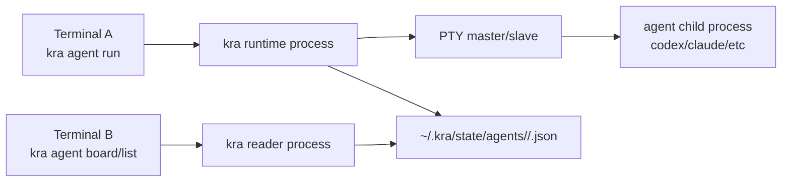

# Agent Runtime Architecture (v3 draft)

## Goal

Define a practical runtime model for `kra agent` that:

- enables PTY-based execution and lifecycle tracking
- avoids Git churn in `KRA_ROOT`
- supports workspace-first operator visibility

## Scope

- runtime process model for `kra agent run/list/board/stop`
- runtime state storage under `KRA_HOME` (default: `~/.kra`)
- session-oriented data model and state transitions

Out of scope:

- distributed multi-host supervision
- socket-based rich request/response control plane
- full historical timeline query API

## High-level Architecture

Key point:
- writer (`run`) and reader (`list/board`) are decoupled via state files.
- terminals do not need direct IPC in MVP.

## Runtime State Location

- root: `KRA_HOME/state/agents/`
- per root: `<root-hash>/`
- per session file: `<session-id>.json`

Rationale:
- runtime churn is outside `KRA_ROOT`
- workspace Git history stays clean

## Session Record (minimum)

- `session_id`
- `root_path`
- `workspace_id`
- `execution_scope` (`workspace` | `repo`)
- `repo_key` (empty when `execution_scope=workspace`)
- `kind`
- `pid`
- `started_at`
- `updated_at`
- `seq`
- `runtime_state` (`running` | `idle` | `exited` | `unknown`)
- `exit_code` (nullable)

## Write/Read Contract

Writer requirements:
- one session = one file
- atomic write (`tmp -> fsync -> rename`)
- monotonic `seq` increase on each update

Reader requirements:
- directory scan by `<root-hash>`
- parse-isolate each file (one broken file must not break whole list)
- aggregate by workspace for board view

## Runtime State Semantics

- `running`: process alive and recent PTY I/O observed
- `idle`: process alive but quiet for threshold duration
- `exited`: process finished
- `unknown`: cannot determine reliably

Human mapping:
- `running` -> `running`
- `idle` -> `idle`
- `exited` -> `stopped`
- `unknown` -> `error`

## Command Interaction Model

`run`:
- resolve workspace target (active only)
- choose execution scope (`workspace` or `repo`)
- start child on PTY
- create/update session record until exit

`list`:
- `tsv`: flat machine-friendly listing from session files
- `human`: workspace summary first
  - always render per-session tree rows under each workspace
  - child row order: `workspace` scope first, then `repo:<repo_key>`

`board`:
- workspace-parent grouped view with execution location children

`stop`:
- resolve session
- signal terminate with grace period
- force kill when needed
- persist final `exited` state
