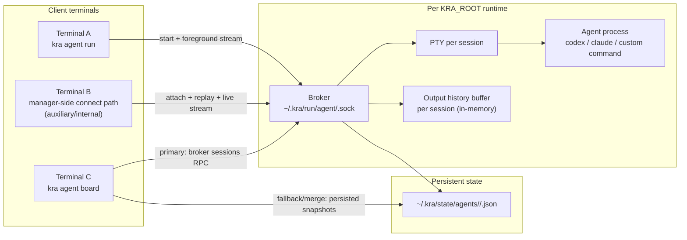

# Agent Runtime Architecture

## Goal

Define a runtime architecture for `kra agent` that:

- supports broker-managed runtime visibility and lifecycle control
- uses foreground single-terminal execution as the default run experience
- keeps attach/reattach as an auxiliary internal recovery path
- keeps runtime files outside `KRA_ROOT` Git working tree

## Decision Snapshot (implemented)

- broker model: per-`KRA_ROOT` local broker over Unix socket
- launch model: interactive TTY foreground by default; non-interactive detached
- connection model: multi-attach view is supported
- attach replay model: broker keeps per-session PTY output history in memory and replays it on attach before live relay
- attach scope: workspace/repo context only (root/outside is error)
- state model: snapshot JSON per session under `KRA_HOME`
- state inference model: PTY output-activity based (no provider history file dependency)
- terminal-sequence signal model: selected OSC/BEL parsing from PTY stream

## Beginner-Friendly Terms

- session: one running agent process instance
- attach: connect terminal I/O to existing session PTY
- detach: disconnect terminal while session keeps running
- broker: local manager process that owns PTYs and child processes
- PTY: pseudo terminal used to run CLI agents as interactive programs

## Component Topology



## Concept Map (ASCII)

```text
KRA_ROOT
└─ root-hash
   ├─ broker socket
   │  └─ ~/.kra/run/agent/<root-hash>.sock
   └─ runtime state
      └─ ~/.kra/state/agents/<root-hash>/
         └─ <session-id>.json

Broker (per root)
├─ session s-...-1234
│  ├─ PTY
│  ├─ output history buffer (in-memory byte stream)
│  ├─ child process (agent CLI)
│  └─ attached clients (0..N)
└─ session s-...-5678
```

## Directory and Socket Layout

- socket path:
  - `~/.kra/run/agent/<root-hash>.sock`
- snapshot path:
  - `~/.kra/state/agents/<root-hash>/<session-id>.json`

Notes:

- same `KRA_ROOT` always maps to same socket path
- different roots are isolated by different `root-hash`

## Broker Lifecycle

- one broker per `KRA_ROOT`
- `run/stop/attach` connect to socket
- when socket is missing/stale, `run` starts broker and reconnects
- broker auto-exits only when:
  - `session_count=0`
  - no broker requests for 60 seconds
- while sessions exist, broker stays alive

## Lifecycle: run (foreground default)

```mermaid
sequenceDiagram
  participant U as User
  participant CLI as kra agent run
  participant B as Broker
  participant PTY as PTY
  participant AG as Agent
  participant ST as Snapshot

  U->>CLI: kra agent run ...
  CLI->>B: connect/start broker if needed
  CLI->>B: start session request
  B->>PTY: allocate PTY
  B->>AG: spawn process
  B->>ST: write runtime_state=running
  alt interactive TTY
    CLI->>B: attach started session
    CLI<->>B: foreground stream
    B->>ST: write runtime_state=exited on process end
  else non-interactive
    CLI-->>U: print session_id and return (detached)
  end
```

## Lifecycle: attach / reattach (internal primitive)

```mermaid
sequenceDiagram
  participant U as User
  participant CLI as manager/connect caller
  participant B as Broker
  participant H as Session history buffer
  participant PTY as Session PTY

  U->>CLI: connect to session <id>
  CLI->>B: attach request
  B->>B: register attachment (paused)
  B-->>CLI: attach accepted + stream open
  B->>H: read buffered output from offset 0
  B-->>CLI: replay buffered output
  B->>H: drain catch-up tail while paused
  B->>B: unpause attachment
  CLI<->>B: stdin/stdout stream
  B<->>PTY: input/output relay
```

## Attach Replay Model (implemented baseline)

- broker stores PTY stdout as append-only in-memory bytes per session
- on `attach`, broker performs:
  - register target attachment in `paused` mode
  - replay full buffered output to rebuild terminal-visible state
  - drain catch-up bytes produced during replay
  - switch attachment to live relay mode
- this design avoids output gaps between replay and live stream for the attaching client

Notes:

- replay source is memory owned by broker process (not persisted to disk)
- when broker exits, replay history is lost; session is already ended at that point
- large/long sessions increase broker memory usage in this baseline

## Attach Scope Resolution

- inside `workspaces/<id>/repos/<repo-key>/...`:
  - candidates are same `workspace + repo`
- inside `workspaces/<id>/...`:
  - candidates are same workspace
- at `KRA_ROOT` root:
  - error (scope too broad)
- outside `KRA_ROOT`:
  - error

## Runtime State

Current process state axis:

- `running`
- `idle`
- `exited`
- `unknown`

Snapshot updates are atomic and increment session `seq`.

## Runtime State Inference (implemented)

- broker infers `running/idle` from PTY output activity, not provider-specific
  screen text phrases
- broker keeps I/O directions separate:
  - input path: attached client bytes written into PTY
  - output path: bytes read from PTY and fanned out to attachments
- state inference uses output path only, so local typing alone does not count as
  child-process progress
- `running`:
  - set when PTY output bytes arrive from the child process
- `idle`:
  - set when PTY output stays silent beyond a short timeout window
- snapshots are persisted on state transition and periodic output heartbeat
- selected terminal sequence hints (`OSC 9` / `OSC 777` / `OSC 133`) are still
  parsed and recorded as runtime signal events for observability, but are not
  the primary driver of `runtime_state`
- broker does not read provider-private history files (for example
  `~/.codex/sessions/*.jsonl`)

## Runtime Signal Events (implemented subset)

- broker appends recognized terminal-sequence events to:
  - `~/.kra/state/agents/<root-hash>/events/<session-id>.jsonl`
- this subset is intended for observability and debugging of state hints, not as
  full lifecycle event sourcing

## Deferred (AGENT-100)

- writer lease / takeover protocol
- dangerous key confirmation
- full lifecycle event sourcing beyond terminal-sequence signal subset
- launch abstraction (`--launch default|resume|continue`)
- attach/input ownership fields in snapshot
