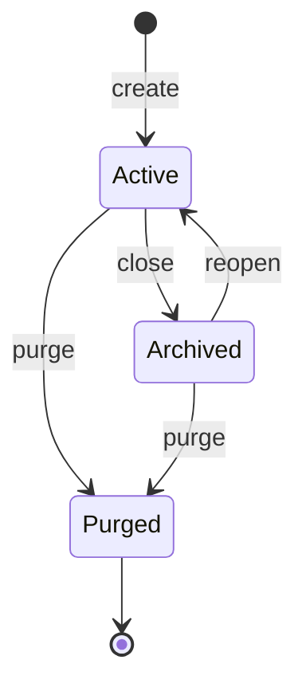

# Workspace lifecycle guide

This guide explains how to operate workspace state safely in daily use.

## State model

A workspace moves through these states:

- `create` -> `active`
- `close` -> `archived`
- `reopen` -> `active`
- `purge` -> terminal cleanup

`close` is the normal way to finish a task. `purge` is a destructive cleanup operation.



- purge guard is `locked` by default on `ws create`
- to run `ws purge`, unlock first with `kra ws unlock`
- lock state is preserved across `ws close` and `ws reopen`

## Typical daily flow

```sh
kra ws create TASK-1234
kra ws add-repo --id TASK-1234
kra ws open --id TASK-1234 --command "claude"
# follow the cmux notification to jump into the workspace
# ...work...
kra ws close --id TASK-1234
```

When reopened later:

```sh
kra ws reopen --id TASK-1234
```

## What `close` does

- evaluates repo risk (`dirty`, `unpushed`, `diverged`, `unknown`)
- asks for confirmation when risk exists
- removes worktrees under `workspaces/<id>/repos/`
- moves non-repo workspace contents to `archive/<id>/`

After `close`, you can review notes/artifacts under `archive/<id>/`.

Example layout:

```text
# active
<KRA_ROOT>/
├─ workspaces/
│  └─ TASK-1234/
│     ├─ notes/
│     ├─ artifacts/
│     └─ repos/
└─ archive/

# archived (after close)
<KRA_ROOT>/
├─ workspaces/
└─ archive/
   └─ TASK-1234/
      ├─ notes/
      ├─ artifacts/
      └─ .kra.meta.json
```

## What `reopen` does

- moves `archive/<id>/` back to `workspaces/<id>/`
- restores repo attachments from workspace metadata (`repos_restore`)

Use this when a finished task needs additional work.

## What `purge` does

- permanently removes workspace and archive data for the target id
- should be used only when you no longer need the task snapshot

If you only want to end active work and keep evidence, use `close`, not `purge`.

## Risk labels used in close/purge preflight

- `dirty`: local file changes exist
- `unpushed`: local branch is ahead of upstream
- `diverged`: local and upstream both advanced
- `unknown`: risk could not be determined

Treat non-clean states as a review gate before destructive operations.

## Related docs

- Command overview: `docs/user/guides/COMMANDS.md`
- Command contracts: `docs/dev/spec/commands/ws/close.md`, `docs/dev/spec/commands/ws/reopen.md`, `docs/dev/spec/commands/ws/purge.md`
- Purge guard contract: `docs/dev/spec/commands/ws/lock.md`
